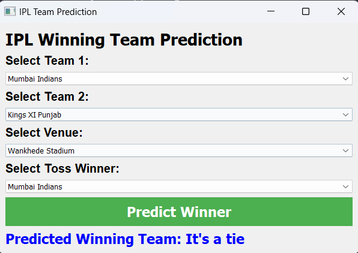

# IPL Winning Team Prediction App using Machine Learning

## Overview

The IPL Winning Team Prediction App is a Python application that predicts the winning team for an IPL (Indian Premier League) cricket match based on user-selected parameters such as the participating teams, venue, and toss winner. It analyzes historical IPL match data to make predictions.

## Features

- **User-Friendly Interface:** The app offers an intuitive and easy-to-use interface for users to input match details and get predictions.

- **Match Prediction:** Users can select two IPL teams, a venue, and the toss winner for a match. The app uses historical match data to predict the winning team for the specified conditions.

- **Real-Time Feedback:** After inputting match details and clicking the "Predict Winner" button, users receive real-time feedback on the predicted winning team.

## Getting Started

To run this IPL Team Prediction App, follow these steps:

1. **Clone the Repository:** Clone this GitHub repository to your local machine.

2. **Install Dependencies:** Ensure you have Python and PyQt5 installed. You can install PyQt5 using pip:

    ```
    pip install PyQt5
    ```

3. **Run the App:** Execute the `ipl_prediction_app.py` script:

    ```
    python ipl_prediction_app.py
    ```

4. **Use the App:** Select participating teams, the venue, and the toss winner for an IPL match. Click the "Predict Winner" button to get the predicted winning team.

## How It Works

The app loads historical IPL match data from the 'matches.csv' dataset and team data from the 'teams.csv' dataset. When a user inputs match details and clicks "Predict Winner," the app filters the historical data based on the selected parameters and calculates the predicted winning team.

## Technologies Used

- **Python:** The core programming language used for building the app.
  
- **PyQt5:** A Python library for creating graphical user interfaces.

- **pandas:** A data manipulation library for Python.

## Example

Here's a screenshot of the IPL Winning Team Prediction GUI:



## Contributions

Contributions to this IPL Team Prediction App are welcome! If you have ideas for improvements or would like to enhance its functionality, feel free to submit issues or pull requests.

##
**Author:** Mangesh Pangam  
**GitHub:** [Mangesh2704](https://github.com/Mangesh2704)  
**Email:** 202103036.mangeshpkr@student.xavier.ac.in

Thank you for using the IPL Team Prediction App. Enjoy predicting IPL match winners! 🏏
