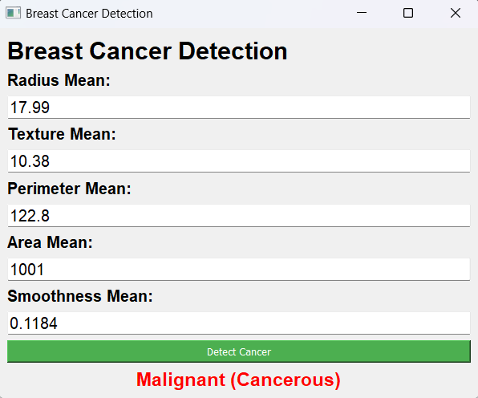

# Breast Cancer Detection App using Machine Learning

## Overview

The Breast Cancer Detection App is a Python application for predicting whether a breast tumor is malignant (cancerous) or benign (not cancerous). It uses a machine learning model trained on breast cancer data to make predictions based on input parameters.

## Features

- **User-Friendly Interface:** The app provides a simple and intuitive user interface for entering five key parameters related to a breast tumor: radius mean, texture mean, perimeter mean, area mean, and smoothness mean.

- **Cancer Detection:** After entering the parameter values and clicking the "Detect Cancer" button, the app uses a machine learning model to predict whether the tumor is malignant or benign. The result is displayed on the screen.

- **Real-Time Feedback:** The app provides real-time feedback, indicating whether the tumor is cancerous or not, with a visual indicator (red for malignant and green for benign).

## Getting Started

To run the Breast Cancer Detection App, follow these steps:

1. **Clone the Repository:** Clone this GitHub repository to your local machine.

2. **Install Dependencies:** Ensure you have Python and PyQt5 installed. You can install PyQt5 using pip:

    ```
    pip install PyQt5
    ```

3. **Run the App:** Execute the `breast_cancer_detection_app.py` script:

    ```
    python breast_cancer_detection_app.py
    ```

4. **Use the App:** Enter the values for radius mean, texture mean, perimeter mean, area mean, and smoothness mean of the breast tumor. Click the "Detect Cancer" button to get the prediction.

## How It Works

The app loads a machine learning model (Random Forest Classifier) that was trained on breast cancer data. When the user inputs the parameter values and clicks "Detect Cancer," the app preprocesses the data and uses the model to predict whether the tumor is malignant or benign. The result is displayed along with a color-coded indication.

## Technologies Used

- **Python:** The core programming language used for building the app.
  
- **PyQt5:** A Python library for creating graphical user interfaces.

- **pandas:** A data manipulation library for Python.

- **scikit-learn:** A machine learning library for Python, used for preprocessing and making predictions.

## Example

Here's a screenshot of the Breast Cancer Detection GUI:



## Contributions

Contributions to this Breast Cancer Detection App are welcome! If you have ideas for improvements or would like to enhance its functionality, feel free to submit issues or pull requests.

##
**Author:** Mangesh Pangam  
**GitHub:** [Mangesh2704](https://github.com/Mangesh2704)  
**Email:** 202103036.mangeshpkr@student.xavier.ac.in

Thank you for using the Breast Cancer Detection App. Stay vigilant about breast health! 🎗️
